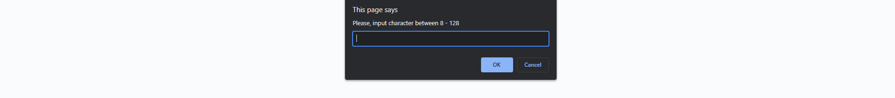
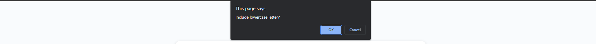
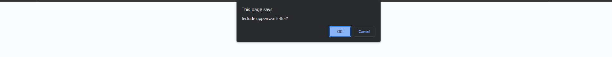
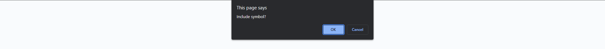
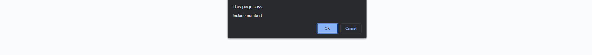

# RANDOM PASSWORD GENERATOR

---

## Motivation

The motivation behind this project is a practicality, as when we sign up for most of the webpage they will request to include uppercase letter, lowercase letter, symbol and number in the password. So this application will come really handy for the people needed to generated password.

---
## Installation

The Installation of this webpage will be straight forward simply click the links below or 
copy the links to the browser you are going to use, to achieve the best experience of 
this website make sure you are using desktop.

Github link is provided to further check and test.

* Webpage Link
https://tirtasty.github.io/Password-Generator/

* Github Link
https://github.com/tirtasty/Password-Generator.git

---

## Usage

** Once you launch the page, automatically the prompt will appear and will ask to input the number between 8 - 128. The valid value will be if you input the number less than 8 and more than 128.

** And then it will continue with confirmation prompt that ask will you include lowercase letter.

** And then it will continue with confirmation prompt that ask will you include uppercase letter.

** And then it will continue with confirmation prompt that ask will you include symbol character.

** And then it will continue with confirmation prompt that ask will you include number.

** Then after that you just need to generate password by click generate password button.

** The whole page will be look like this if you keep scrolling around.

---
## Contributors

- Tirta Styadi - <tirta.setiady@yahoo.com>

---

##

© Tirta Styadi, University Of Sydney Coding Bootcamp